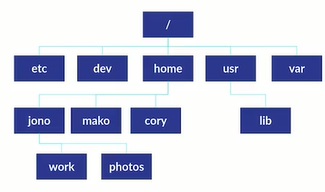

# INTRODUCCIÓN A LA TERMINAL Y LÍNEA DE COMANDOS

[Version en notion](https://www.notion.so/INTRODUCCI-N-A-LA-TERMINAL-Y-L-NEA-DE-COMANDOS-0c9aaa7eaa8544c0b0a8f6c71564de61) 


## INTRODUCCIÓN

Por qué aprender a manejar la consola:

- Flexibilidad. Se pueden mover grandes volúmenes de información. Podemos ver qué es lo que está pasando detrás de los procesos
- Velocidad. Tiende a ser mucho más rápida que la interfaz gráfica.
- No siempre cuentas con una interfaz gráfica
- Puedes generar un daño severo en el sistema.

¿Qué es la terminal?: Es una interfaz gráfica que simula una línea de comandos. La terminal es una ventanita que nos muestra el prompt. Este aloja a la shell

Shell: línea de comandos. Un programa que toma comandos y los pasa al sistema operativo para hacer algo. 

Ingresamos los comandos, la shell la va a interpretar por nosotros y le va a decir al sistema operativo qué hacer.

Tipos de Shells:

- Bourne Shell
- Bash Shell: muy común.
- Z Shell: muy común.
- C Shell
- Korn Shell
- Fish Shell
- PowerShell: Es de window.

Comando: Un programa que se puede ejecutar desde la terminal. Este puede recibir parámetros y opciones. 

Sistema de archivos:

El sistema de archivos (ruta) de nuestro sistema operativo (linux en este caso) está constituido por las siguientes carpetas



Podemos hacer click [aqui]([https://www.geeksforgeeks.org/linux-file-hierarchy-structure/](https://www.geeksforgeeks.org/linux-file-hierarchy-structure/)) para aprender un poco más acerca del sistema de archivos.

En los sistemas operativos organizamos los archivos en una estructura de carpetas en forma de árbol jerárquico. Este árbol cambia dependiendo de los diferentes sistemas operativos (no tanto en Linux y Mac).

Todo inicia en un / (el equivalente en Windows podría ser el fichero “C:\”). Esto normalmente se le llama la raíz de nuestro sistema de archivos.

- Home: contiene una carpeta por cada usuario del sistema y ya dentro de cada una de estas carpetas, estarán las carpetas que conocemos de toda la vida como imágenes, documentos, música, etc.

Información al inicio de la terminal:


- `yese`: nombre de usuario activo.
- `DESKTOP-TU7CE2S`: es el nombre que el sistema operativo le dio a la computadora.
- `~`: Virgulilla. Es la carpeta en la que te encuentras. Es un atajo también.
- `$`: significa que somos un usuario normal y no un root o un superusuario.

Gama de colores:

- Azul oscuro: carpetas.
- Azul claro: archivos.

Anatomía de un CLI o Command Line Interface:


Binario: Es un programa que queremos ejecutar

## EL COMANDO

Un comando es un mensaje enviado al ordenador que provoca una respuesta en este sistema y se comporta como una orden, pues informa al dispositivo informático que debe ejecutar una acción según la indicación que pueda enviarse.

A continuación conocerás todo lo relacionado con sistemas operativos basados en UNIX y sus comandos básicos en la terminal.

Un comando pueden significar 4 cosas:

1. Un programa ejecutable. Se compiló en algún lenguaje de programación y nosotros lo podemos ejecutar.
2. Un comando de utilidad de la shell. La shell es un programa en sí mismo, que puede tener funciones (ejemplo, cd).
3. Una función de shell. Son funciones de shell externas al comando de utilidad (ejemplo, mkdir).
4. Un alias (ejemplo, ls).

Comandos para los comandos:

- `type <comando>`: muestra qué tipo de comando es. Muestra la naturaleza del comando.
- `help <comando>`: muestra todo lo que podemos hacer con el comando señalado.
- `whatis`: ofrece una descripción muy corta del comando señalado (en una sola línea). No funciona con todos.
- `alias [nombreNuevo]=”<secuencia de comandos>”`: nos permite crear comandos. Son temporales y se borran al cerrar la terminal. Ejecutará lo que esté entre comillas.
- `man <comando>`: De manual de usuario. Nos permite conocer mucha más información de un comando.
- `info <comando>`: Similar a man, pero un poco resumido y con otro formato.

## COMANDOS

En el siguiente [link]([https://platzi.com/blog/41-comandos-terminal/](https://platzi.com/blog/41-comandos-terminal/)) hay más comandos.

`echo` : Genera un Standar Output en la terminal de cualquier cosa que le escribamos.

`date` : Imprime por consola la fecha actual.

`cal` : imprime un pequeño calendario de la fecha actual.

`wc`: Work code. Nos sirve para contar cuantas palabras hay en un documento. La primera columna nos indica cuantas líneas tiene el archivo, la segunda nos indica cuantas palabras en general tiene y la tercera el número de bytes.

- `wc -l`: Nos permite contar el número de líneas.
- `wc -w`: Nos da el número de palabras
- `wc -c`: Nos da el número de bytes.

### Caminando en la terminal

`pwd`: significa Print Working Directory y te muestra el directorio en el que te encuentras.

`cd`: Change Directory. esto es para moverte entre carpetas sin salir de la terminal.

`ls`: list. Muestra lo que está dentro de cada carpeta.

- `ls -la`: muestra la lista de todos los archivos, incluidos los ocultos (tienen un punto antes del nombre).
- `ls -lS: Size` : Ordena todos los directorios o documentos por tamaño
    - `ls -lSh`: lo mismo pero muestra cuanto pesa cada documento.
- `ls -l`: Lista los archivos. La tercera columna muestra el nombre del usuario que es propietario del archivo y la cuarta columna muestra el grupo que tiene control sobre el archivo.

`tree`: Para ver archivos. Despliega todo el directorio como si fuera un árbol. Por ejemplo:

```bash
tree -L 2: 
```

profundiza en niveles. En este caso profundiza en 2 niveles.

`-l`: long. Para conocer más información como la fecha de creación, peso, permisos, etc.

`-h`: Human Readable. Se usa como el `-l` para ver más información pero en una forma que podamos entender.

`file`: te da información acerca del tipo de elemento que hayas seleccionado.

```bash
file + [nombre de archivo]
```

`clear` o Ctrl + L: limpia nuestra pantalla.

### Manipulando archivos y directorios

`mkdir`: Make Directory. Crea directorios o carpetas. Es recomendable no crear el nombre con espacio (para hacer espacios hay que poner las palabras entre comillas).

```bash
mkdir [nombre de directorio]
```

para crear varios: 

```bash
mkdir nombre_de_directorio1 nombre_de_directorio1 
```

`touch`: Funciona igual que el comando mkdir. Crea archivos.

`cp`: Copy. Sirve para copiar un archivo. Si no le ponemos una ruta lo pega ahí mismo. Para generarle una ruta de pegado: mv.

```bash
cp [nombreDelArchivoParaCopiar] [nombreParaLaCopia]
```

`mv`: Move. Mueve archivos. También renombra archivos.

```bash
mv [archivoParaMover] [destinoDelArchivo]
```

```bash
mv [archivoParaRenombrar] [NuevoNombreDeArchivo]
```

`rm`: Remove. Elimina archivos o carpetas.

```bash
rm [nombreDelArchivoParaEliminar]
```

Tiene varias opciones:

- `rm -i`: Interactive. Te pregunta si estás seguro de eliminar el archivo. Se responde con **y** o **n**.
- `rm -r`: Recursive. Elimina todo lo que esté dentro de una carpeta.
- `rm -f`: Force. Fuerza a borrar todo. Esta se usa cuando no puedes borrar algún archivo, bien sea porque algo lo está usando o porque se está ejecutando.

### Explorando el contenido (texto) de nuestros archivos

`head`: Muestra las primeras 10 líneas de un archivo de texto. También sirve para ver los archivos (para que puedas ver la línea de comandos).

```bash
head [nombreDelArchivoParaAbrir]
```

- si quieres ver las primeras N cantidad de líneas:
    
    ```bash
    head [nombreDelArchivoParaAbrir] -n [N]
    ```
    

`tail`: Muestra las últimas 10 líneas de un archivo de texto.

```bash
tail [nombreDelArchivoParaAbrir]
```

- si quieres ver las últimas N cantidad de líneas:
    
    ```bash
    tail [nombreDelArchivoParaAbrir] -n [N]
    ```
    

`less`: Muestra todo el documento. Muestra todo el contenido dentro de la consola. “Less is more”. Este es más efectivo que `head` para inspeccionar archivos.

```bash
less [nombreDelArchivoParaAbrir]
```

`/`: Se puede usar para buscar palabras dentro del documento. Para esto hay que usarlo después de imprimir o ver el documento usando head, tail o less. En la parte de abajo se habilitará un cuadro donde podrás buscar palabras, solo escribe y presiona enter.

`q`: salir de la interfaz.

`xdg-open`: abre el archivo que desees en el programa predeterminado para su extensión. Abre un programa para inspeccionar ese archivo.

```bash
xdg-open [archivoParaAbrir]
```

`nautilus`: se usa para abrir una carpeta. Es igual que sdg-open, solo que debes seleccionar una carpeta. Abre en la interfaz de ventanas la carpeta que selecciones.

Ctrl + C: mata cualquier proceso que se esté ejecutando en la terminal.

### Comandos de búsqueda

`which`: Nos ayuda a encontrar la ruta de nuestros binarios.

`whereis`: Es un comando algo similar al `wich`, pero mejor. Localiza los ficheros binarios, fuentes y páginas del manual de un programa

`find` : Para encontrar archivos de forma efectiva. Buscará en la ruta que le indiques el tipo de archivos que necesitas.

```bash
find [rutaDesdeDondeEmpezarBuscar] [opciones]
```

`-name`: Segmentar por el nombre. Por ejemplo, vamos a buscar en la carpeta home todos los archivos que tenga una extensión “.png”.

```bash
find ./ -name *.png
```

`-type`: Segmentar por el tipo de archivo, si es un archivo o si es un directorio. Este acepta:

- `f` para archivos.
- `d` para directorios
- `l` para enlaces simbólicos.
- Si quieres usar más de una opción, lo separas por comas.

Ejemplos:

```bash
find ./ -type f -name "f*”
```

Esto me muestra todos los archivos que comiencen con la letra “f”.

```bash
find ./ -type f,d -name "D*”
```

Esto me muestra todos los archivos que comiencen con la letra “D”.

`-size`: Segmentar por tamaño ingresando el peso que queremos buscar. Tiene un uso especial:

1. Tenemos que colocar la unidad de peso:
    - `c`: byte
    - `k`: kilobyte
    - `M`: Megabyte
    - `G`: Gygabyte
2. Como es difícil atinarle al peso de un archivo, por lo que podemos especificar que sea ese peso en adelante con el símbolo `+` o de ese peso ara abajo con el símbolo `-`.

```bash
find ./ -size +4k
```

Esto, por ejemplo, busca los archivos que pesen 4kb o más.

`-empty`: Busca archivos vacíos. Por ejemplo:

```bash
find ./ -type d -empty
```

Para buscar todas las carpetas vacías.

`-maxdepth` y `-mindepth`: Limitamos la profundidad máxima de las carpetas a la que el comando debe buscar con `-maxdepth` seguido de la profundidad.

```bash
find ./ -type d -maxdepth 2
```

Cuando nos queremos saltar niveles de profundidad le asignamos una profundidad mínima al comando con `-mindepth`

```bash
find ./ -type d -mindepth 2
```

- Es recomendable pasar el output al comando `less`, así:
    
    ```bash
    find ./ | less
    ```
    
    De esta forma podrás usar esa interfaz de `less` para buscar tus archivos.
    

### Comango `grep`

`grep` significa Global Regular Expression Print. El comando `grep` utiliza regex (Regular Expression) para realizar su búsqueda, lo que lo hace uno de los comandos más útiles que vas a poder usar.

```bash
grep [ExpresiónRegular] [archivoDondeBuscar]
```

- Ignorar el case sensitive (`-i`): Busca independientemente si es mayúscula o minúscula.
    
    ```bash
    grep -i [ExpresiónRegular] [archivoDondeBuscar]
    ```
    
- Contar ocurrencias (`-c`): Si quieres saber cuántas veces se repite una palabra.
    
    ```bash
    grep -c [PalabraABuscar] [archivoDondeBuscar]
    ```
    
- Excluir una expresión (`-v`): Para saber cuáles son los resultados que NO coinciden con tu expresión regular. Por ejemplo, si queremos contar todas las películas que no son de drama, escribimos:
    
    ```bash
    grep -cv Drama movies.csv
    ```
    
- Limitar la búsqueda (`-m`): Para no buscar en todo el archivo, sino las primeras ocurrencias, podemos limitar la búsqueda en líneas con la opción `-m`, seguida del número de líneas que queremos encontrar. Por ejemplo, si queremos buscar las primeras 10 l´neas que concuerden con la palabra “Fan” escribimos:
    
    ```bash
    grep -m 10 Fan movies.csv
    ```
    

## ATAJOS

`cd ~`: nos permite volver al home

`/`: te lleva a la raíz donde están todas las carpetas del sistema operativo

### Operadores de ruta relativa:

`.` : indica la carpeta actual. Se puede usar para ir a rutas más específicas (`./Desktop/Notas` por ejemplo).

`..` : `cd ..` te envía a la carpeta que está atrás.

## ¿QUÉ HACER SI APARECE UN ERROR?

Si usas un comando que no tienes, como si quieras usar VS Code sin instalarlo, debes prestar atención al mensaje y utilizar el comando para poder usar el comando `xdg-open`.

## WILDCARDS

Las wildcards o comodines son una serie de caracteres especiales que nos permiten encontrar patrones o realizar búsquedas más avanzadas. Es aplicable para archivos y directorios.

Las wildcards te sirven para realizar seccionamiento de archivos o directorios, ademas de `ls` los wildcards tambien pueden usarse con cualquier comando que realice la manipulación de archivos como `mv`, `cp` y `rm`.

### Tipos de Wildcards:

`*`: Buscar todo. 

El asterisco te ayuda a buscar toda la información dentro de una carpeta, pero puedes limitar su uso. Ejemplos:

```bash
ls -l *.png
```

```bash
ls -l <caracteres>*. 
```

Este último sirve para buscar todos los archivos que comiencen por unos caracteres específicos.

`?`: Busca por cantidad de caracteres. 

Lo vemos con varios ejemplos:

```bash
ls -l foto?.png . 
```

Aquí estás indicando:

- Busca todo lo que comience por la cadena de caracteres “foto”.
- Que inmediatamente después tenga un solo caracter
- Que al final tenga la cadena de caracteres “.png”.

```bash
ls -l foto???.jpg . 
```

Aquí estás indicando:

- Busca todo lo que comience por la cadena de caracteres “foto”.
- Que inmediatamente después tenga 3 caracteres.
- Que al final tenga la cadena de caracteres “.jpg”.

`[]`: 

Sirve para buscar por varios caracteres específicos. Por ejemplo:

```bash
ls -l [ci]*: 
```

Si quieres buscar los archivos que comiencen por las letras “c” o “i” y que tengan lo que sea por delante.

```bash
ls -l foto[2-6]*: 
```

Busca todo lo que comience por la cadena de texto “foto”, y que justo después tenga un número entre el 2 y el 6; y que tenga lo que sea por delante.

- Hay que tener en cuenta que esta wildcard es case sensitive (si pones minúscula, solo trae minúsculas).

Combinaciones:

`ls -l <caracteres>??.*`: si estás buscando algo que no sabes el tipo de extensión que tiene y tiene 2 caracteres justo después del nombre.

## REDIRECCIONES

Entradas y salidas:

En la conosola generamos una entrada cuando escribimos y una salida casi siempre que ejecutamos un comando.

- Standar Input: Nombre típico de las entradas. Se les suele abreviar como **stdin**.
- Standar Output: Nombre típico de las salidas. Se les suele abreviar como **stdout**.

File descriptors:

Son números que identifican un recurso. Funciona asociando un número con una acción, archivo o programa, en el caso de la shell tenemos 3 file descriptors:


- El 0 es Standar Input.
- El 1 es Standar Output.
- El 2 es Standard Error (**stderr**).

`>` : Operador de redirección. 

Redirecciona la salida. Si quieres que el Standard Output no vaya a la consola sino hacia un archivo, usamos el operador > seguido del nombre dle archivo en el que quieres guardar la salida.

```bash
ls -l > output.txt
```

`>>`: Concatenar. 

Sirve para cuando ya tienes un archivo creado y quieres agregarle más información sin eliminar lo que estaba adentro del archivo (concatenar el contenido del documento con el de la salida).

```bash
ls -l >> output.txt
```

`2>|2>&1` : Redirección de errores.

El operador de redirección por defecto solo redirecciona el standard Output. Para redirigir un error tenemos que especificar que queremos el Standard Error. También podemos especificar que no importa lo que pase si me da un Standar Output o un Standar Error, igual tiene que guardar la salidad en un archivo; esto lo hacemos así:

```bash
ls -l > output.txt 2>&1
```

El `2>` redirecciona el file descriptor 2. El `2>&1` Redirecciona el file descriptor 2 y 1.

## REDIRECCIONES: PIPE OPERATOR

Pipe Operator es un operador que permite tomar la salida de un comando y pasarla como entrada de otro comando. (|)

```bash
ls -lh | less
```

Para ver la información como una entrada y no como una salida. Aquí ya lo podemos explorar.

### Comandos de Pipe operator:

`cat` :Unir cadenas de texto

Usamos `cat` si queremos crear una lista de los archivos de varias carpetas, concatenando la salida de varios de ellos.

```bash
cat archivo1.txt archivo2.txt
```

Si queremos dejar de escribir solo hay que presionar Ctrl + D.

`tee`: Crear un archivo con base en una salida

Guarda la lista creada con `cat` usando el comando `tee` , el cual creará un archivo con esa salida. 

```bash
cat archivo1.txt archivo2.txt | tee archivos.txt
```

Ejemplo:

```bash
ls -lh | less | tee output.txt
```

Para crear un archivo de mi output después de verlo con `less` 

```bash
ls -lh | tee output.txt | less
```

Para generar el archivo y luego verlo con `less`

`sort` : Organizar archivos

Organiza alfabéticamente una salida.

```bash
ls | sort | tee archivosHome.txt
```

Con este código estamos:

- Listandos los archivos
- Organizando los archivos
- Creando un archivo llamado archivosHome.txt, con las salidas anteriores.

## ENCADENANDO COMANDOS: OPERADORES DE CONTROL

Los operadores de control son símbolos reservados por la terminal que nos permiten encadenar comandos.

Asíncrona: por cada comando que yo ejecute se va a abrir una shell o una línea de comandos en segundo plano, es decir, va a usar un hilo de mi procesador por cada comando que yo esté ejecutando. Esto permite ejecutar comandos de manera paralela, sin embargo hay que tener cuidado porque podemos atorar un proceso o hacer un comando que se ejecute indeifnidamente.

### Operadores de control:

`;`: Ejecuta de forma síncrona los comandos especificados. Para ejecutar varios comandos en la misma línea sin tener que dar enter constantemente.

`&` : Ejecuta de forma asíncrona los comandos especificados. Para llevar a cabo varios comandos, al mismo tiempo (asíncronos). Usamos el operador `&` entre cada comando que queremos ejecutar. La terminal crea varios hilos para ejecutar la cantidad de comandos que le hayamos puesto (sale [n] N siendo n el número del hilo y N el id).

### Comandos con condicionales:

Podemos ejecutar comandos dependiendo de condiciones.

`&&`: Condición **AND**. 

Estamos indicando que para que estos comandos se ejecuten, el comando anterior tuvo que ejecutarse correctamente.

`||` : Condición **OR**. 

Prueba todos los comandos que le pongas a ve cuál se ejecuta, sin importar que el anterior lo haya hecho o no. Ejecuta el comando si el anterior o la combinación de los anteriores resultaron en verdadero. No es asíncrono.

Combinaciones (ejemplos):

```bash
cd carpeta1/ || cambia-carpeta carpeta1/ && mkdir Proyecto1
```

Con este código estamos:

- Yendo a la carpeta1 con cd
- Marca un error con cambia-carpeta carpeta1, ya que no existe ese comando.
- creando un archivo llamado Proyecto1 ya que el operador OR devolvió TRUE porque al menos un comando funcionó.

## PERMISOS

Los permisos son las capacidades que tiene cada usuario dentro del sistema operativo, no todos los usuarios pueden hacer todas las acciones sobre ciertos archivos y carpetas.

### Tipos de archivos:

`-` : Es un archivo normal, como un documento de texto, una foto, un video, etc.

`d` : Por directory. Es un directorio.

`l` : Es un enlace simbólico.

`b` : Bloque especial, son archivos que manejan información para el sistema, como la infromación de un disco duro.

### Permisos de usuario:

Los siguientes caracteres se leen de 3 en 3, por cada uno de los tipos de usuario:

Owner: El dueño del archivo, si no se ha cambiado, es quien lo creó y tiene mayor jerarquía sobre los otros 3. Le corresponden los primeros 3 caracteres de los permisos.

Group: Se puede crear grupos de usuarios para darle a todos o varios los mismos permisos. A estos usuarios le corresponden el cuarto, quinto y sexto caracter de los permisos de usuarios y tienen mayor jerarquía que el último.

World: También llamado “otros”, es cualquier otro usuario que no pertenezca a un grupo de usuario y tampoco sea el dueño, este tiene la menor jerarquía.

### Tipos de permisos:

| Símbolo | Significado | Permiso |
| --- | --- | --- |
| r | readable | Significa que puede leer su contenido |
| w | writable | El usuario puede editar el contenido del archivo, también el nombre y los permisos |
| x | executable | El usuario puede ejecutarlo en caso de que sea un programa |

| Permiso | Archivo | Directorio |
| --- | --- | --- |
| r | Permite abrir y leer un archivo. | Permite listar el contenido de un directorio solo si el permiso de ejecución (x) también está activo. |
| w | Permite escribir en un archivo; sin embargo, este atributo no permite cambiar el nombre de los archivos o eliminarlos. La capacidad de eliminar o cambiar el nombre de los archivos está determinado por los atributos del directorio. | Permite que los archivos dentro de un directorio sean creados, eliminados y
renombrados si también se establece el atributo de ejecución. |
| x | Permite que un archivo sea tratado como un programa y pueda ser ejecutado. | Permite entrar al directorio. |

Los permisos se escriben en ese orden rwx. Para indicar que el permiso no está disponible, se escribe un guion.

### Ejemplos:

```bash
drwxr-xr-**x**
```

Esto significa:

| d | rwx | r-x | r-x |
| --- | --- | --- | --- |
| Esto es un directorio | owner | group | world |
|  | El dueño puede leer, escribir y ejecutar | El grupo puede leer y ejecutar | Los demás pueden leer y ejecutar |

```bash
r w - r- - r - -
```

Esto significa:

| - | rw- | r– | r– |
| --- | --- | --- | --- |
| Esto es un archivo normal, como una imágen o un video | owner | group | world |
|  | El dueño puede leer y escribir | El grupo sólo puede leer | El resto sólo puede leer |

### Representnado permisos de forma octal:

Si organizamos los permisos de esta forma

| r | w | x |
| --- | --- | --- |

E indicamos con un cero si el usuario no tiene el permiso y con un uno si el usuario si lo tiene, pongamos de ejemplo el permiso`r-x` :

| r | w | x |
| --- | --- | --- |
| 1 | 0 | 1 |

Y ahora esos números los leemos en binario, nos quedaría así:

| r | w | x |
| --- | --- | --- |
| 1 | 1 | 1 |
|  | 7 |  |

Si repetimos esto con el resto de las combinaciones tenemos un número por cada combinación de permiso, por ejemplo el permiso `r-x`
 queda así:

| r | - | x |
| --- | --- | --- |
| 1 | 0 | 1 |
|  | 5 |  |

Usando todo esto podemos leer el conjunto de permisos `rwxr-xr--` , así:

| r | w | x |  | r | - | x |  | r | - | - |
| --- | --- | --- | --- | --- | --- | --- | --- | --- | --- | --- |
| 1 | 1 | 1 |  | 1 | 0 | 1 |  | 1 | 0 | 0 |
|  | 7 |  |  |  | 5 |  |  |  | 4 |  |


## COMANDOS PARA PERMISOS

`chmod` : Con el podemos cambiar los permisos de los archivos de dos formas: usando los símbolos (rwx) o con el sistema octal.

De forma simbólica:

```bash
chmod [simboloDelUsuario][operador][permiso] [archivoParaCambiarSusPermisos]
```

Donde cada opción puede ser:

```bash
[simboloDelUsuario]
```

- `u` (de user): Owner
- `g` : Group
- `o` : Others o World

```bash
[operador]
```

- `+` : Añade un permiso
- `-` : Quita un permiso
- `=` : Asigna un permiso. Esto sobreescribe los permisos.

Tips:

- Puedes cambiar varios permisos de varios usuarios al mismo tiempo. Por ejemplo:
    
    ```bash
    chmod go+wx [archivo]
    ```
    
- Si quieres permisos diferentes para cada usuario, solo sepáralos por comas. Por ejemplo:
    
    ```bash
    chmod u+r,g=w [archivo]
    ```
    
    No agregues espacio en las comas o provocarás un error.
    

`whoami | su` : Este comando te muestras cual es el usuario que se está ejecutando, esto es porque a veces podemos olvidar con cual usuario estamos trabajando.

`su` : Para cambiar de usuario. Switch User, seguido del usuari oal que quieres cambiar.

`chown` : Change Owner. Para cambiar el propietario.

```bash
chown [usuarioAlQuePertenecerá] [archivo]
```

`sudo` : El usuario sudo no te loguea como root o cualquier otro usuario, sino que te da los permisos.

### ¿Qué hacer en caso de olvidar una contraseña?

Si estás usando Windows Subsystem for Linux (wsl) y se te olvidó la contraseña del root. Sigue estos pasos:

1. Abre el cmd de windows y ejecuta este comando wsl --user root. Esto hará que se inicie en la terminal wsl con el usuario root.
2. Luego ejecuta el comando `passwd` root el cual te permitirá cambiar la contraseña del usuario root.

## VARIABLES DE ENTORNO

Las variables de entorno son útiles cuando necesitamos que cierta información prevalezca para poder trabajar más rápido o necesitamos guardar información para no tener que recordarla constantemente.

En linux hay varias variables de entorno que ya están preestablecidas; para verla desde la consola solo debemos usar el comando seguido de la variable de entorno.

```bash
[comando] + [VariableDeEntorno]
```

- Todas las variables de entorno se mandan a llamar con un signo de peso por delante.
- Por convención las variables de entorno se crean en mayúsculas.
- El símbolo de suma es `:` al hacer una variable de entorno

`printenv`: Nos muestra todas las variables de entorno que hay configuradas.

`$HOME`: Indica el home del usuario

`$PATH`: Indica las direcciones de donde están los binarios que usa el sistema.

`$BASH_VERSION`: Indica la versión del bash que estás utilizando.

`$SHELL`: Dirección de la shell que estás utilizando

### ¿Cómo crear tus propias variables de entorno?:

1. En el home de tu usuario hay un archivo oculto llamado “.bashrc”. Abrelo utilizando el comando  `code .bashrc` . Desde este archivo oculto podemos crear una variable de entorno.


1. Escribimos la variable y lo que hace
2. Le damos guardar
3. Reiniciamos la terminal (con `bash`)
4. Probamos.
    - Aquí también podemos crear alias que no se borrarán una vez cerrada la terminal
        
        
        

## UTILIDADES DE RED

Aquí aprenderás comandos básicos de utilidades de la red para que puedas obtener la información que necesites.

`ifconfig`: Muestra la configuración de los dispositivos de red. Al escribir esto en la terminal vemos varia información:

- eth0: Nombre del dispositivo de red.
- Y su configuración, tenemos su dirección IPv4 e IPv6 y su máscara de red.

`netstat`: Es lo mismo que `ifconfig`, pero lo mostrará de forma más amigable usando una tabla.

`ping`: Envía solicitudes a una página. Este comando envía paquetes a esa página y evalúa el tiempo de respuesta. Por defecto, el comando se ejecutará indefinidamente, así que tienes que detenerlo con Ctrl + C

```bash
ping [URL]
```

Con esto obtenemos:

- La dirección IP de esa URL
- Cuanto tiempo tardó en responder la página medida en milisegundos
- En la parte de abajo tenemos el total de paquetes que se enviaron, los que se recibieron, el porcentaje de paquetes perdidos y el tiempo de respuesta promedi ode las consultas.

También hay varias opciones de este comando:

- `ping -c`: Limita los paquetes enviados.
    
    ```bash
    ping -c [númeroDePaquetesPorEnviar] [URL]
    ```
    
- `ping -s`: Especifica el tamaño de los paquetes. Para probar la conectividad con paquetes de diferentes tamaños se utiliza la opción -s seguido del tamaño del paquete que desees usar. El tamaño debe ser en bytes.
    
    ```bash
    ping -s [TamañoDelPaquete] [URL]
    ```
    

`curl | wget`: Podemos obtener archivos que nos proporcione un sitio web o dirección IP con el comando curl. Este te mostrará la información que haya encontrado en la consola.

```bash
curl [URL]
```

Al ejecutar este comando te dará el documento “.html” de la página.  

El comando `wget` hace algo similar, solo que en vez de mostrar lo que h obtenido por consola lo guarda en el archivo que le especifiques.

```bash
wget [URL]
```

En la última línea de la salida del comando te dice donde guardó la información.

También podemos específicar varias direcciones para descargar varias páginas al mismo tiempo.

`traceroute`: Cuando nos conectamos a una página en internet no nos conectamos directamente a los servidores en los que está almacenada esa página, sino que primero pasamos por otros servidores que son como intermediarios entre tu computadora y el servidor. Nos sirve si nos queremos conectar a un servidor de red.

## COMPRIMIR ARCHIVOS TAR Y ZIP

### Archivos .tar:

El formato .tar es un tipo de compresión bastante usado en UNIX. Originalmente era utilizado para almacenar información en cintas magnéticas, así que está hecho especialmente para comprimir los archivos de forma lineal.

Para comprimir con este formato en la terminal usamos el comando `tar` que tiene ciertas opciones para aprender.

```bash
tar [opciones] [nombreDelArchivoComprimido] [archivoAComprimir]
```

Donde las opciones son (En todos los casos hay que usar la opción `-f` para indicar que estamos comprimiendo o descomprimiendo archivos. ):

- `-c`: Comprimir un archivo.
    - `-v`: Verbose. Si queremos ver lo que está haciendo el comando. Muchos comandos la usan, también te la puedes encontrar como `--verbose`
        
        ```bash
        tar -cvf [nombreDelArchivoComprimido] [archivoAComprimir]
        ```
        
    - `-z`: Comprimir con formato “.tar.gz” o también “.tgz”. Este formato es una versión extendida del formato tradicional de compresión “.zip” que puede manejar y comprimir archivos más grandes. Al usar esta opción también se debe especificar en el nombre de archivo la extensión que quieres usar.
        
        ```bash
        tar -czvf compressed.tar.gz Documents/toCompress/
        ```
        
- `-x`: Descomprimir un archivo. Si se quiere descomprimir un archivo de extensión “.tar.gz” o “.tgz” hay que especificar la opción `-z` también.
    
    ```bash
    tar -xzvf compressed.tar.gz
    ```
    

### Archivos .zip:

Para comprimir usamos el comando `zip` con el nombre que quieres que tenga y lo que quieres comprimir.

Si quieres comprimir una carpeta con archivos dentro, tienes que especificar la opción `-r` de “recursive”.

```bash
zip -r copressed.zip Documents/toCompress/
```

- Si lo que vamos a comprimir es una carpeta, tenemos que usar la opción `-r`.

Para descomprimir usamos el comando `unzip`:

```bash
unzip compressed.zip
```

## MANEJO DE PROCESOS

Puedes manejar lso procesos como visualizar, eliminar o filtrar desde la terminal de un modo diferente a usar Ctrl + Alt + Suprimir.

`ps`: Muestra los procesos que están activos en una tabla muy sencilla de entender. La primera columna es el process ID (PID) y en la última el nombre.

`top`: Muestra una lista más detallada de los procesos con su consumo en CPU y en RAM, además del usuario que lo activó.

- Podemos filtrar por user presionadno la tecla “u” para escribir el nombre de usuario por el cual quieres buscar.
- Si presionar la tecla “h” mostrará un cuadro de ayuda para más opciones.
- Para salir se presiona “q”.
- Existe la opción `htop`, que es un poco más avanzada que `top`

`kill`: Para matar un proceso. Lo usamos seguido del PID del proceso que queremos matar.

### Procesos en foreground y background

Cuando un proceso está en ejecución sin que sea mostrado en la terminal se dice que se está ejecutando en el background. Si se muestra la ejecución del comando dentro de la terminal se dice que está en el foreground.

- CTRL + Z: Suspende o pausa el proceso. Con esto movemos el proceso al background de la terminal.
- CTRL + C: Finaliza o mata un proceso.
- `fg`: Para traer la ejecución de nuevo a la tarminal, es decir, al foreground.
    
    ```bash
    fg [NumeroDeTrabajo]
    ```
    

`jobs`: Para consultar todos los procesos que tenemos en background.

- A la izquierda aparece el número del trabajo ( ⚠ ️ cuidado que no es lo mismo que el process ID).

### Otras formas de enviar al background

Usando el operador de control `&` al final de un comando: Este nos permite enviar de manera directa un proceso al background una vez ejecutado.

Comando `bg`: Sirve de manera similar que `fg`, solo que en vez de traerlo al foreground este lleva un trabajo al background.

## EDITORES DE TEXTO EN LA TERMINAL

Una de las utilidades más importantes de la terminal es el editor de texto. Hay diferentes opciones, pero Vim es uno de los más sencillos y populares. También está Emacs y Nano.

### Vim:

Para abrir o crear un archivo utilizando Vim:

```bash
vim [nombre del archivo]
```

- Por defecto no podrás escribir hasta que actives el modo de inserción. Para hacerlo usa la tecla `i`
- Para salir del modo de inserción presiona la tecla ESCAPE.
- En el modo normal (en el que no puedes escribir) si escribes `/` activarás un buscador similar al del comando `less`.
- Para borrar una línea (en modo normal), te ubicas sobre ella y presionas `dd`
- Para guardar y salir (en modo normal) activa los comandos usando `:` y escribe `wq`  (w para guardar y q para salir).

## PRESONALIZAR LA TERMINAL DE COMANDOS

Para esto podemos usar un emulador llamado Tilix. En Tilix podemos tener varias terminales activas.

1. Instalamos tilix
2. Instalamos zsh
3. Volvemos a zsh nuestra shell por defecto.
    
    ```bash
    chsh -s $(which zsh)
    ```
    
    Para cambiar a bash, solo cambiamos zsh por bash
    
4. Apretar la opción 0, para crear un archivo .zshrc en blanco).